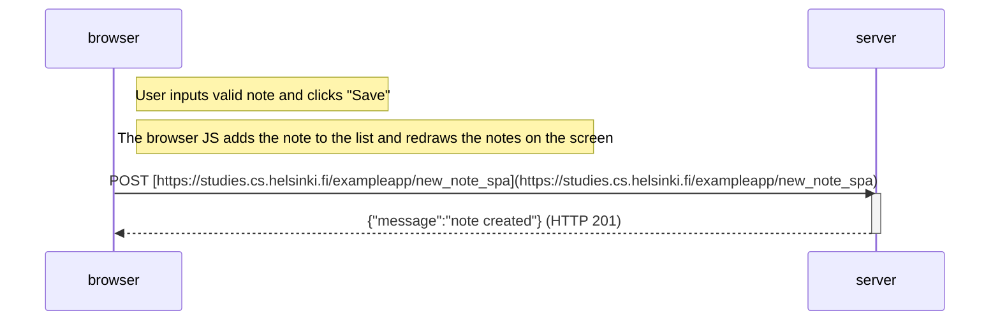

```mermaid
sequenceDiagram
    participant browser
    participant server

    Note right of browser: User inputs valid note and clicks "Save"

    Note right of browser: The browser JS adds the note to the list and redraws the notes on the screen

    browser->>server: POST [https://studies.cs.helsinki.fi/exampleapp/new_note_spa](https://studies.cs.helsinki.fi/exampleapp/new_note_spa)
    activate server
    server-->>browser: {"message":"note created"} (HTTP 201)
    deactivate server
```
